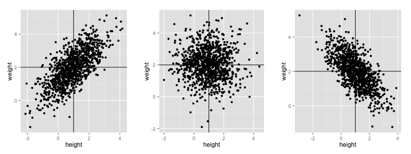
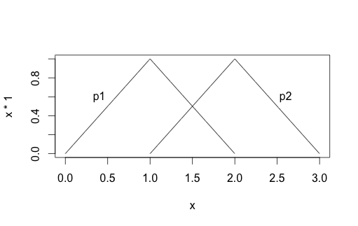

## What Is Probability Density Function ##

Probability density function (PDF) is defined as a function on some n-dimensional real value that satisfy following constraints:

1. $p(x) \geq 0 ~~~\forall x \epsilon \mathbb{R}^2$ ==> applying PDF on any n-dimensional value should give value greater than equal to 0 
2. $\int_{\mathbb{R}^2}p(x)dx = 1$ ==>  area of under the curve should be equal to 1

For discrete value, probability density function is also referred as **probability mass function**. It gives probability of a random variable being exactly some real value. 

Note that **probability density function is different from probability distribution function**. Probability density function gives probability of a random variable having some specific value whereas probability distribution function is a cumulative probability of having some random variable $X$ having value $\leq x$. i.e.
$$probability density function  = p(X=x)$$
$$Probability~Distribution~Function=\int_{-\infty}^{x}p(x)dx$$

Summary:

* Discrete Variable
	- Probability Mass Function -- it answer what is the probability of X being exactly x
	- Cumulative Distribution Function -- it answers what is the probability of X being $\leq x$
* Continuous Variable
	- Probability Density Function -- answers what is the probability of X being in the neighborhood of x. 
	-  Probability Distribution Function -- answers what is the probability of X being less than or equal to x


## What Is a Variance-Covariance or Dispersion Matrix ##

* Mean: $\mu = \frac{\sum{x}}{n}$
* Biased Variance: $\sigma^2=\frac{1}{n}\sum_{i=1}^{n}(x-\mu)$
* Unbiased Variance: $\sigma^2=\frac{1}{n-1}\sum_{i=1}^{n}(x-\mu)$

Now to understand covariance, consider following  three distributions of two random variables X (say height) and Y (say weight).  Let say we want to denote the three relations in the below plots by a numerical value which is > 0 for plot 1,  = 0 for plot 2 and < 0 for plot 3.

```R
library('MASS')
library('ggplot2')
library('grid')

covars = c(0.7, 0, -0.7)
par(mfrow = c(1, 3))
out <- NULL
counter = 1
for (covar in covars){
  d1 <- as.data.frame(mvrnorm(1000, c(1,2), matrix(c(1.0, covar, covar, 1), nrow=2)))
  p <- ggplot() + 
    geom_point(aes(x=V1, y=V2), data=d1) + 
    geom_vline(xintercept=1) + 
    geom_hline(yintercept=2) +
    xlab("height") + ylab("weight") 
  out[[counter]] = p
  counter = counter + 1
}
grid.arrange(out[[1]], out[[2]], out[[3]], ncol=3)
```

One way to do this is move the origin of the axes in the three plots to the mean of the two random variables (this is show by intersection to two straight lines). Now all the data 
are split in four regions. If we take production x and y values in each these quadrants it will be positive in quadrant 1 and 3 and negative in quadrant 2 and 4. 

Further if we take mean of these products i.e $\frac{1}{n}\sum_{i=1}^{n}(x_i-\mu_X)*(y_i-\mu_Y)$, then it will > 0 for plot 1 as there more values in quadrant 1 and 3 then in quadrant 2 and 4. Similarly for plot 2 it will be around 0 and for plot 3 it will be less than 0. Thus we can write covariance as
$$cov(X,Y) = $\frac{1}{n}\sum_{i=1}^{n}(x_i-\mu_X)*(y_i-\mu_Y)$$

Also note that $Cov(X,Y) = \sigma^2$ i.e. covariance of X to itself is same as variance. 

Now assume we have n dimensional euclidean space i.e point is represented by a vector of size n. If We take covariance of each dimension to all the other dimension we will get a $nXn$ **symmetric matrix** where diagonal elements represents variance. This matrix is referred as variance-covariance matrix and is denoted by $\Sigma$. 

$$\Sigma = \begin{pmatrix}
 cov(x_1, x_1) & cov(x_1,x_2) & \cdots  & cov(x_1,x_n)\\ 
 cov(x_2,x_1) & cov(x_2,x_2) & \cdots & cov(x_2, x_n)\\ 
\cdots  & \cdots  & \cdots & cov(x_n,x_n) \\
\end{pmatrix}$$

Variance-covariance matrix has the following properties:

1. **Square**: It is a square matrix i.e. number of rows = number of columns
2. **Symmetric**: Values across diagonals are same. i.e val(1,3) = val(3,1) 
3. **Non negative Definite**:  Euclidean distance between two points in a n-dimensional space is given as $d(x,y)=\sqrt{\sum_{i=1}^{n}(x_i - y_i)^2}$. However in this form euclidean distance is sensitive to scale of the dimension. For instance, consider two person whose height and weight are measured in meter and kg. Based on the above equation we calculate distance between these two persons. Now let's say instead of using meter and kg we use meter and lbs as measuring unit and recalculate distance. The two computed distances will be different. This is somewhat counterintuitive as the two persons are same. To overcome this problem, euclidean distance is sometimes calculated as:
	$$d(x,y)=\sqrt{\sum_{i=1}^{n}w_i(x_i - y_i)^2}$$

	We can further rewrite above equation in matrix form as show below
	$$d(x,y)= \begin{pmatrix}
x_1-y_1 &  x_2-y_2& \cdot & x_n-y_n
\end{pmatrix} \begin{pmatrix}
w_1 & 0 & \cdot & 0 \\ 
0 & w_2 & 0 & 0 \\ 
\cdot & \cdot & \cdot & \cdot \\ 
0 & 0 & \cdot & w_n 
\end{pmatrix}\begin{pmatrix}
x_1-y_1 \\
x_2-y_2 \\
\cdot \\
x_n-y_n
\end{pmatrix}$$

	We can further generalize above linear algebra by replacing all 0 with appropriate weights:

	$$d(x,y)= \begin{pmatrix}
x_1-y_1 &  x_2-y_2& \cdot & x_n-y_n
\end{pmatrix} \begin{pmatrix}
w_{11} & w_{12} & \cdot & w_{1n} \\ 
w_{21} & w_{22} & \cdot & w_{2n}\\ 
\cdot & \cdot & \cdot & \cdot \\ 
w_{n1} & w_{n2} & \cdot & w_{nn} 
\end{pmatrix}\begin{pmatrix}
x_1-y_1 \\
x_2-y_2 \\
\cdot \\
x_n-y_n
\end{pmatrix}$$

	Now by definition distance is always $\geq$ 0. Thus any weight matrix $w$ that gives above distance $>$ 0 is called **positive definite**. Theoretically **positive definite** is defined as any square matrix A for which
	
	$$A = Positive~Definite ==> if a^TAa > 0 ~~~\forall a \neq \begin{pmatrix}
0 \\ 
0 \\ 
\cdots\\ 
0 
\end{pmatrix}$$

	Similarly we can define **positive semi definite** matrix $A_{nXn}$ as a matrix for which $a^TAa \geq 0 ~~\forall a$. Positive semi definite matrix is also known as **non negative matrix**. 

	An important characteristic of positive definite matrix is that all its eigen value are positive. This property is further useful in Gaussian distribution.

Note: Positive definite by itself indicate that the matrix is symmetric and symmetric metric by itself indicates that the matrix is square. 


## Explain Gaussian Distribution Function  ##

Gaussian distribution function is a probability density function that has the following form:
$$p(x) = N(x|\mu, \Sigma) = \frac{1}{(\sqrt{2\pi})^n|\Sigma|^\frac{1}{2}}exp\{-\frac{1}{2}(x-\mu)^T\Sigma^{-1}(x-\mu)\} ~~~\forall ~~~x~\epsilon~\mathbb{R}^n$$

where:

* $\mu$ is mean vector
* $\Sigma$ is a variance-covariance matrix or **dispersion matrix**. It is $nXn$ matrix 
* $|\Sigma|$ is a determinant of variance-covariance matrix. Although determinant of a matrix is not necessarily always positive. If this happens then the above equation can result in non real number if  $|\Sigma| <  0$ ) or undefined value (if $|\Sigma| := 0$). This contradicts definition of PDF which has to be strictly $> 0$. Hence $|\Sigma|$ has to be strictly greater than 0. 

	As discussed in the above Variance-Covariance section, Variance-Covariance matrix is non-negative definite matrix. But for Gaussian distribution it can be show than Variance-Covariance matrix $|\Sigma|$ is a **positive definite matrix** and hence all its eigen values are positive. Now determinant of a matrix is product of its eigen values and hence it can shown that $|\Sigma| > 0$ 

## Pattern Recognition Steps ##
Pattern recognition involves two types of transformation. 

1. Measurement Space --> Feature Space: This step involves feature selection
2. Feature Space --> Decision Space: This step involves supervised or unsupervised classification. Supervised classification can be of two types:
	1. Conditional Probability density function and prior probabilities are known: Assume we want to differentiate male from female. We conduct an exhaustive survey where we randomly choose a person and record gender and height. Assume we surveyed 100 people and ended up with 60 male and 40 female. Then we have some prior information of a person being male and its P(x=male) = 0.6 and P(x=female) = 0.4. Based on the above survey we can also get distribution function for male and female. Assuming the heights of male and females are normally distributed we can represent the distribution for male and female class by $\mu$ and $\sigma$. Lets $\theta_m$ and $\theta_f$ represent distribution parameters for male and female class, respectively.   

		Now let's say we pick another random person and measure his/her height (say $x$). Based on the above information and by applying bayesian principle we can estimate the probability of this random person to be male or female based on his/her height.  As per bayesian equation it is given as 
		$$P(m|x) \propto P(x|m) * P(m)$$

		where $P(x|m)$  can be computed the known distribution of male class and is prior on male class $P(m)$ which happens to be 0.6.  

		**Probability of Misclassification or Total Error**
		**Base Error Probability**
		**Example**

		- Cost of Error


		One important assumption we made over here is that we assumed distribution parameters are fixed and we were able to uniquely calculate them from our sample. However we pick 100 people at random 100 times we might get different distributions for male and female class. Thus mean and variance for male and female classes are by themselves have there own distribution. 


	2. Training sample points are known

## What Is the Probability of Misclassification or Total Error Base . ##

Assuming we have two classes and we know conditional probability density function ($p_1(x), p_2(x)~~\forall~ x~\epsilon~\mathbb{R}^n$) and prior probabilities ($P_1, P_2$). Let $\Omega$ be set of all possible values $x$ can take. This can be either $\mathbb{R}^n$ of subset of $\mathbb{R}^n$ i.e. $\Omega \subseteq $\mathbb{R}^2$. Let $\Omega_1,~\Omega_2$ represent the space pertaining to the two classes we have. If x is within the space of $\Omega_1$ then we assume x belongs to class 1. Similarly if x is within $\Omega_2$ then we assume x belongs to class 2. 

For $\Omega_1$ and $\Omega_2$ to be called as decision space, they should satisfy following constraints:

1. $\Omega_1 + \Omega_2 = \Omega$ i.e. the two spaces should cover all the possible values of x. 
2. $\Omega_1 \cap \Omega_2 = \phi$ i.e the two spaces can't be overlapping
3. $\Omega_1 \neq \phi$ and $\Omega_2 \neq \phi$ i.e neither of two spaces can be empty. 

Now error can happen in two ways:

1.  x is actually belongs to class 1 but based on our decision space it belongs to $\Omega_2$. The total error associated with this kind of error can be computed as $P_1 \int_{\Omega_2} p_1(x)dx$. Remember that x although fall in $\Omega_2$   space has certain probability associated of being of belonging to class 1. This probability decreases as we move away (more into the $\Omega_2$ space) from the decision boundary and eventually becomes zero. $\int_{\Omega_2}p_1(x)dx$ gives us area of this region which when multiplied by priori probability gives the joint probability.
2.  x belongs to class 2 but based on our decision space it belongs to $\Omega_1$. The total error associated with this kind of error can be computed as $P_2 \int_{\Omega_1} p_2(x)dx$. 

Thus the total misclassification error (probability of misclassification or error probability) is given as:
$$\varepsilon(\Omega_1, \Omega_2) = P_1 \int_{\Omega_2} p_1(x)dx + P_2 \int_{\Omega_1} p_2(x)dx$$

Note that above we are assuming that the cost of misclassification is same. But in certain cases (for example in medical machine learning saying someone does not have cancer then vice-versa). Thus we can rewrite above equation as

$$\varepsilon(\Omega_1, \Omega_2) = w_1P_1 \int_{\Omega_2} p_1(x)dx + w_2P_2 \int_{\Omega_1} p_2(x)dx$$

Now in order to find optimal decision space we want to find $\Omega_1, \Omega_2$ such that it minimizes above error probability as compared to all the other decision space. Let the optimal decision is given by $\Omega_1^o$ and $\Omega_2^o$. Then $$\varepsilon($\Omega_1^o, \Omega_2^o) \leq \varepsilon(\Omega_1, \Omega_2)~\forall~D$$
where D represents all decision spaces. 

In order to find the optimal decision space we need to minimize above error probability equation. However we can simplify the error probability as follows:

$$\varepsilon(\Omega_1, \Omega_2) = w_1P_1 \int_{\Omega_2} p_1(x)dx + w_2P_2 \int_{\Omega_1} p_2(x)dx$$

Assuming cost of error is same for all classes and by adding and subtracting $ P_1 \int_{\Omega_1} p_1(x)dx$ we get 
$$\varepsilon(\Omega_1, \Omega_2) = P_1 \int_{\Omega_2} p_1(x)dx + P_2 \int_{\Omega_1} p_2(x)dx + P_1 \int_{\Omega_1} p_1(x)dx - P_1\int_{\Omega_1} p_1(x)dx$$
 
we can combine component 1 and 3 above and also component 2 and 4 as show below
$$\varepsilon(\Omega_1, \Omega_2) = P_1 \int_{\Omega_1 \cup \Omega_2} p_1(x)dx + \int_{\Omega_1}{(P_2 p_2(x) - P_1 p_1(x))dx}$$

Since $\int_{\Omega_1 \cup \Omega_2} p_1(x)dx=1$, we can rewrite above eqn as

$$\varepsilon(\Omega_1, \Omega_2) = P_1  + \int_{\Omega_1}{(P_2 p_2(x) - P_1 p_1(x))dx}~~~~(A)$$

Similarly instead of adding  $ P_1 \int_{\Omega_1} p_1(x)dx$ if we add and subtract $ P_12\int_{\Omega_2} p_2(x)dx$, we get 

$$\varepsilon(\Omega_1, \Omega_2) = P_2  + \int_{\Omega_2}{(P_1 p_1(x) - P_2 p_2(x))dx}~~~(B)$$

Now:
$$A+B = 2\varepsilon(\Omega_1, \Omega_2) = (P_1 + P_2) + 
\int_{\Omega_1}{(P_2 p_2(x) - P_1 p_1(x))dx} + \int_{\Omega_2}{(P_1 p_1(x) - P_2 p_2(x))dx}$$

$$2\varepsilon(\Omega_1, \Omega_2) = 1 + \int_{\Omega_1}{(P_2 p_2(x) - P_1 p_1(x))dx} + \int_{\Omega_2}{(P_1 p_1(x) - P_2 p_2(x))dx} ~~~ (C)$$

In order to minimize eqn C, the optimal space can be any one of the following: 

1. $\Omega_1 = \{x: P_1p_1(x) \geq P_2p_2(x)\} , \Omega_2 = \{x: P_1p_1(x) < P_2p_2(x) \}$
2. $\Omega_1 = \{x: P_1p_1(x) > P_2p_2(x)\} , \Omega_2 = \{x: P_1p_1(x) \leq P_2p_2(x) \}$

There can be many different optimal spaces where the error probability is minimized but in all the cases the total error $\varepsilon(\Omega_1, \Omega_2)$ will be the same. The decision space corresponding to the minimal total error is referred as **Bayes Decision Space (or Rule)**. It can be shown that no matter what decision space (or classifier) you use, its probability of misclassification will be greater than or equal to that of Bayes decision rule but it can be never less than bayes decision rule. 

### Example  to show that Bayes decision rule gives minion error probability###
Consider we have two classes with the known probability density function as given below.:

1. $p_1(x) = \left\{\begin{matrix}
x;  & 0 < x < 1\\ 
 2-x& 1 \leq x < 2\\ 
 0 & otherwise
\end{matrix}\right.$
2. $p_2(x) = \left\{\begin{matrix}
x-1;  & 1 < x < 2\\ 
 3-x& 2 \leq x < 3\\ 
 0 & otherwise
\end{matrix}\right.$

```R
curve(x*1, 0, 1, xlim=c(0,3))
curve(2-x, 1,2,add=TRUE)
curve(x-1, 1, 2, add=TRUE)
curve(3-x, 2, 3, add=TRUE)
text(0.4, 0.6, "p1")
text(2.6, 0.6, "p2")
```
 

As explained above in order to obtain optimal space we need to find $\Omega_1$,  $\Omega_2$ such that $Pp_1(x) \geq (1-P)p_2(x)$ in $\Omega_1$ and  $Pp_1(x) < (1-P)p_2(x)$ in $\Omega_2$ space. It can be shown that one of the optimal solution that satisfy above constraints is $\Omega_1 = [0, 1+P]$ and $\Omega_2 = (1+P, 3]$. Now total error is given as 

$$\varepsilon(\Omega_1, \Omega_2) = P\int_{\Omega_2}p_1(x)dx + (1-P)\int_{\Omega_1}p_2(x)dx$$

 $$\varepsilon(\Omega_1, \Omega_2) = P\int_{1+P}^{3}p_1(x)dx + (1-P)\int_{0}^{1+P}p_2(x)dx$$

Since $p_1(x) == 0~\forall~x \geq 2$ and $p_2(x) = 0~\forall~x \leq 1$ we can change limited in the above integration 
 i.e  $$\varepsilon(\Omega_1, \Omega_2) = P\int_{1+P}^{2}p_1(x)dx + (1-P)\int_{1}^{1+P}p_2(x)dx$$

 i.e  $$\varepsilon(\Omega_1, \Omega_2) = P\int_{1+P}^{2}(2-x)dx + (1-P)\int_{1}^{1+P}(x-1)dx.$$

$$\varepsilon(\Omega_1, \Omega_2) = P\begin{bmatrix}\frac{(2-x)^2}{2}\end{bmatrix}_{1+P}^{2} + (1-P)\begin{bmatrix}\frac{(x-1)^2}{2}\end{bmatrix}_{1}^{1+P}$$

$$\varepsilon(\Omega_1, \Omega_2) = P\frac{(1-P)^2}{2} - (1-P)\frac{P^2}{2}$$
$$\varepsilon(\Omega_1, \Omega_2) = \frac{P(1-P)}{2}$$

Above eqn represents Bayes Decision Rule. Now we select any other decision boundary than $\Omega_1 = [0, 1+P]$ and $\Omega_2=(1+P,3]$ we can show that the error probability will be $\geq \frac{P(1-P)}{2}$. For instance if we take $\Omega_1 = [0, 1.2]$ and $\Omega_2=(1.2,3]$ then total error is given 

$$\varepsilon(\Omega_1, \Omega_2) = P\int_{\Omega_2}p_1(x)dx + (1-P)\int_{\Omega_1}p_2(x)dx$$
$$\varepsilon(\Omega_1, \Omega_2) = P\int_{1.2}^3p_1(x)dx + (1-P)\int_0^{1.2}p_2(x)dx$$
Again, since $p_1(x) == 0~\forall~x \geq 2$ and $p_2(x) = 0~\forall~x \leq 1$ we can change limited in the above integration 
$$\varepsilon(\Omega_1, \Omega_2) = P\int_{1.2}^2p_1(x)dx + (1-P)\int_1^{1.2}p_2(x)dx$$
$$\varepsilon(\Omega_1, \Omega_2) = P\int_{1.2}^2(2-x)dx + (1-P)\int_1^{1.2}(x-1)dx$$
$$\varepsilon(\Omega_1, \Omega_2) = 0.64P/2 + 0.04(1-P)/2 = 0.02 + 0.3P$$

Now we need to prove that  $0.02 + 0.3P \geq P(1-P)/2$. We can simplify this eqn as:
$$0.04 + 0.6P \geq P-P^2$$
$$P^2 - 0.4P + 0.04 \geq 0$$
$$(P-0.2)^2 \geq 0$$

Above eqn is true for any value of P since P can only in range of [0, 1]. Thus we can say that error probability associated $\Omega_1 = [0, 1.2]$ and $\Omega_2=(1.2,3]$ is $\geq P(1-P)/2$

## What Is Minimum Distance Classifier ##

Minimum distance classifier is the best classifier for classifying M classes under following assumptions: 

1. Probability distribution function for all classes is normal distribution i.e $p_i = \frac{1}{(\sqrt{2\pi})^n|\Sigma_i|^\frac{1}{2}}exp\{-\frac{1}{2}(x-\mu_i)^T\Sigma_i^{-1}(x-\mu_i)\}  ~\forall i=1,2,\cdots,M$
2. All the priori probabilities are same i.e. $P_1 = P_2 = \cdots = P_M = 1/M$
3. All covariance matrices are equal and they are equal to identity matrix i.e. $\Sigma_1 = \Sigma_2 = \cdots = \Sigma_M = I$

Under such assumptions we say a random point in the space belongs to class i if 

$$P_ip_i(x) \geq P_jp_j(x)~~\forall~~j \neq i$$ 
$$P_i \times  \frac{1}{(\sqrt{2\pi})^n|\Sigma_i|^\frac{1}{2}}exp\{-\frac{1}{2}(x-\mu_i)^T\Sigma_i^{-1}(x-\mu_i)\} \geq P_j \times  \frac{1}{(\sqrt{2\pi})^n|\Sigma_j|^\frac{1}{2}}exp\{-\frac{1}{2}(x-\mu_j)^T\Sigma_j^{-1}(x-\mu_j)\}$$

$\because$ all priori probabilities are same and covariance matrixes are equal to identity matrix we can simply above equation to

$$exp\{-\frac{1}{2}(x-\mu_i)^T\Sigma_i^{-1}(x-\mu_i)\} \geq exp\{-\frac{1}{2}(x-\mu_j)^T\Sigma_j^{-1}(x-\mu_j)\}$$

$\because$ inverse of an identity matrix is an identity matrix itself we can remove $\Sigma_i^-1$. 

$$exp\{-\frac{1}{2}(x-\mu_i)^(x-\mu_i)\} \geq exp\{-\frac{1}{2}(x-\mu_j)^T(x-\mu_j)\}$$

Further taking log on both side we get (Note that we have changed $\geq$ to $\leq$ because we removed $-$ sign). 

$$(x-\mu_i)^T(x-\mu_i) \leq (x-\mu_j)^T(x-\mu_j)$$

Thus we say x belongs to class i if **distance** of x is minimum from the mean of the $i^{th}$ class.  Hence this classifier is called **Minimum Distance Classifier**. 


		
## What Are the Desirable Properties of Features ##
1. invariant to affine transformations such as rotation, scale transportation, etc. 
2. it should be high variance
3. computational cost of the feature should not be high
4. must have graceful degradation to missing values and 


## List Different Methods of Clustering and Classification ##
**Clustering Methods:**

- Representative Points
- Split & Merge
- Linkage
- SOM
- Model Based
- Vector Quantification

**Classification Methods**

- Bayesian Decision Rule
- LDA 
- KNN
- FFNN
- SVM
- Random Forest

## General Categories of Clustering Data ##

1. Partitional
	1. Exclusive
		1. MST
		2. K-mean
		3. K-medoid
	2. Probabilistic
		1. GMM
		2. FCM
2. Hierarchical (linkage based)
	1. Agglomerative
	2. Divisive

## Linear Algebra Basics ##

* $A + B = B + A$
* $A + (B + C) = (A + B) + C$
* $A(BC) = (AB)C$
* $A(B~\pm~C)=AB~\pm~AC$
* $a(B~\pm~C)=aB~\pm~aC$
* $a(bC) = (ab)C$
* $a(BC)=(aB)C=B(aC)$
* $A == B~if~a_{i,j} = b_{i,j}$
* $A X B \neq B X A$.
* $if~C=AB ~then~c_{i,j}=\sum_{k=1}^{n}a_{ik}b_{kj}$
* $Trace(A) = \sum_{i=1}^n a_{ii}$ ==> Sum of diagonal elements
* $A - A = 0$
* $0 - A = -A$
* $0~\cdot~A = 0, A~\cdot~0 = 0$
* $A^nA^m = A^{n+m}$
* $(A^n)^m = A^{nm}$
* $(A^T)^T = A$
* $(cA)^T = cA^T$
* $(AB)^T=B^TA^T$: Note that order of A and B has changed. 
* $A^{-1}A=AA^{-1}=I$ Multiplying a matrix with its own inverse in any order gives back an identity matrix. However for this to be true only if the matrix is
	1. is a square matrix
	2. determinant of matrix is not equal to zero. Such matrix are called non singular. Thus inverse of a matrix only exits if a matrix is non singular. 
* If $(AB)$ is invertible i.e. its determinant is nonzero then
	*  $(AB)^{-1}=B^{-1}A^{-1}$
	*  $(A^{-1})^{-1}=A$
	*  $(A^n)^{-1} = (A^{-1})^n$
	*  (A^T)^-1=(A^-1)^T

**Type Of Matrix**

-  Square Matrix: $Rows=Cols$
- Zero Matrix / null matrix: All values are zero.
- One Matrix: All values are one
- Identity Matrix: All values along the diagonal are one and rest are zero
- Diagonal Matrix: Except diagonal all values are zero. i.e $d_{i,j} = 0~if~i \neq j~\forall i,j \epsilon \{1,2,...,n\}$. This applies to rectangular (or non-square matrix) also. Inverse of a diagonal matrix is is given by taking the reciprocal of the diagonal elements. 
- Triangular Matrix
- Symmetric Matrix
- If A is a symmetric matrix then $AA^T$ and $A^TA$ are also symmetric. 
- If A is invertible and symmetric then $A^-1$ is also symmetric
- If A is invertible then $AA^T$ and $A^TA$ are both invertible. 

### Eigen Values & Eigen Vectors ###


### Rank of a Matrix ###

It is defined as:

1. Dimension of the column (or row) space of a matrix
2. Largest order of any nonsingular minor of a matrix


  


*[PDF]: Probability Density Function
